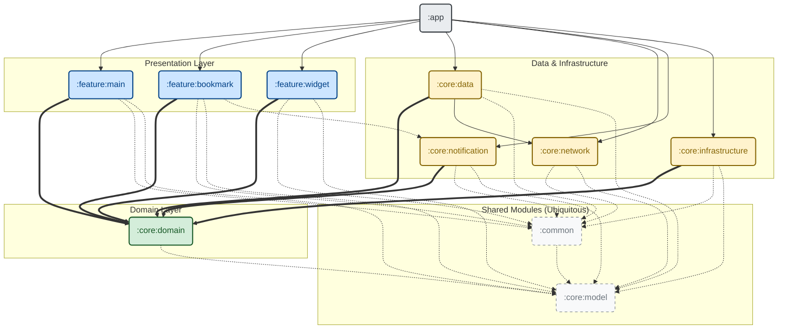

    
     
     
    

# 🔔 KNUTICE 

**Korea National University of Transportation Announcement Aggregator**

> **Role:** Android Engineer (Native)
> 
> **Status:** Live in Production (Google Play Store)
> 
> **Users:** 300+ Total Users / 190+ MAU

# 💁 Service Introduction

**"Never miss a campus update again."**

KNUTICE is a utility service that delivers real-time push notifications the moment a new announcement is posted on the university website.

I developed this service to help students avoid the hassle of manually checking the homepage and to ensure they never miss critical information regarding scholarships or academic schedules.

# ⚒️ Tech Stack

Built with a focus on stability, scalability, and modern Android development standards.

- **Language:** `Kotlin`
    
- **UI:** `Jetpack Compose` (Material3), `Jetpack Glance` (Widget),  `Navigation for Compose`
    
- **Architecture:** `Multi-Module Clean Architecture`, `MVI (Unidirectional Data Flow)`
    
- **Async & Stream:** `Coroutines`, `Flow (StateFlow, SharedFlow)`
    
- **DI:** `Dagger 2`
    
- **Local DB:** `Room` (FTS4, Custom Tokenizer applied), `DataStore`, `SharedPreference`
    
- **Background Task:** `WorkManager` (PeriodicWork, Chained Task)
    
- **Network:** `Retrofit2`, `OkHttp`
    
- **CI:** `GitHub Actions`
    

# ⚙️ Architecture

To ensure long-term maintainability and scalability beyond simple feature implementation, I adopted **Multi-Module Clean Architecture**.

- **Multi-Module Strategy:** Decomposed the codebase into `app`, `core`, `feature`, `domain`, and `data` modules. This separation of concerns reduced code coupling and significantly improved build efficiency.
    
- **MVI Pattern:** Explicitly separated `State`, `Event`, and `SideEffect` to manage data flow unidirectionally. This made the UI state predictable and greatly simplified the debugging process.

### Dependency Graph

# 🚀 Technical Challenges & Solutions

A summary of key engineering challenges encountered during production and how I solved them.

### 1. Enhancing Search Precision (Room FTS4 + Tokenization)

When searching through saved notices (Bookmarks), standard SQL `LIKE` queries resulted in poor accuracy. For example, searching for "Notice" (`공지`) would incorrectly include unrelated results like "Artificial Intelligence" (`인공지능`) due to substring matching.

- **Room FTS4 (Full-Text Search):** Migrated the local database to use FTS4 for optimized text search capabilities.
    
- **Custom Tokenization:** Integrated a Korean morphological analysis library (`OpenKoreanTextProcessor`) to tokenize search terms. By applying these tokens to FTS queries, I successfully **filtered out semantic false positives (e.g., 'Artificial Intelligence'), ensuring only relevant results matching 'Notice' are returned.**
    

### 2. Custom Markdown Renderer (Parser & Native UI)

Rendering AI-generated Markdown from the server using third-party libraries resulted in UI inconsistencies that clashed with the app's design language.

- **Native Component Mapping:** Beyond simple text styling, I implemented a rendering engine that maps structural Markdown elements (Headers, Tables, Dividers, Lists) to distinct **Native Composables**. This ensured 100% consistency with the app's Material Theme.
    
- **Recursive Text Parsing:** For complex inline formatting (e.g., nested syntax like `_**Bold & Italic**_`), I applied a **DFS-based recursive algorithm** to accurately parse the structure into `AnnotatedString`, ensuring precise rendering of compound text styles.
    

### 3. Optimizing UI Response & UX (Staging Table & WorkManager)

Writing to an FTS-enabled table is slower than standard tables due to the indexing process. Even when offloaded to `Dispatchers.IO`, saving a bookmark took long enough to keep the `CircularProgressIndicator` (loading state) active, degrading the user experience.

- **Staging Table Strategy:** Implemented a lightweight "Staging Table" for immediate writes. When a user bookmarks an item, it is instantly saved here, allowing the UI to return to a success state immediately without blocking.
    
- **Deferred Indexing:** Configured a chained **WorkManager** pipeline to migrate data from the Staging Table to the FTS Table in the background. This approach secured both high performance and a seamless user experience.

    
### 4. Reliable Push Notification Management (PeriodicWork)

If the app remains unused for extended periods or the device enters Doze mode, FCM tokens can become stale or unsynchronized, leading to missed notifications.

- **PeriodicWork:** Deployed **WorkManager** to periodically synchronize the FCM token with the server and validate its status. This ensures that users reliably receive critical announcements even if they do not open the app frequently.

### 5. Memory Leak Prevention & Navigation Optimization
Unrestricted bottom-navigation switching in Compose can lead to duplicate ViewModel instantiations and excessive memory bloat in the JVM.

- **Single-Top Routing & State Restoration**: Restructured the Navigation for Compose implementation to use nested navigation graphs. By enforcing strict Single-Top routing (`launchSingleTop = true`) alongside UI state restoration (`restoreState = true`), I capped ViewModel instances to exactly 1 per tab.

- **State Delegation & Custom Back-Stack**: Completely decoupled the UI layer from navigation actions by creating a MainServiceState holder. By managing a custom tabHistory queue inside this state holder, I ensured precise, chronological back-navigation behavior while keeping the AnimatedBottomBar component entirely stateless and focused strictly on rendering.

- **Profiling Impact**: Conducted rigorous Android Studio memory profiling, demonstrating a 70% decrease in retained ViewModel memory and a 23.6% reduction (252,650 objects) in total JVM object allocations during standard user traversal.

### 6. Overcoming Jetpack Glance Constraints & Lifecycle Synchronization
To provide quick access to Study Room statuses, I implemented Home Screen widgets using Jetpack Glance. However, Glance translates Composables into OS-level RemoteViews, which entirely lack support for custom Canvas drawing—meaning my Ring Graph UI couldn't be rendered natively.

- **Background Bitmap Rendering**: Bypassed this OS limitation by constructing an off-main-thread pipeline that programmatically generates the Ring Graph as a static Bitmap, which is then passed to the Glance widget.

- **Lifecycle-Aware Synchronization**: Engineered a dual-layer refresh policy to guarantee data consistency between the main application and the widget. While a Dagger-injected `WidgetSyncWorker` handles periodic background updates, I integrated ProcessLifecycle observation to trigger immediate, local cache-based widget refreshes the moment the application enters the foreground or background, ensuring users always see the most up-to-date state.

### 7. File I/O Stability & MIME-Type Handling
Before version 1.7.0, downloading specific file types (like .hwp) resulted in corrupted filenames or files failing to download entirely. The root cause was an over-reliance on server-side MIME-type declarations and the mishandling of UTF-8 encoded filenames within the data stream.

- **Client-Side Resolution & Decoding**: Restructured the download logic to independently determine accurate MIME types on the client side and strictly decode UTF-8 filenames before passing the data to Android's DownloadManager.

- **Standardized Storage UX**: Rather than creating an isolated, app-specific folder (a common file-system anti-pattern), I explicitly routed all attachments to the native public Downloads directory. This preserved a seamless, expected user experience.

### 8. Scalable Build Environment with Convention Plugins
As the project transitioned to a Multi-Module architecture, managing Gradle dependencies and compiler configurations across numerous modules led to significant boilerplate and potential version inconsistencies.

- **Centralized Build Logic**: Implemented Gradle Convention Plugins (build-logic) using Kotlin DSL to centralize dependency management, SDK versions, and Compose compiler settings.

- **Maintainability Impact**: This infrastructure update eliminated redundant build.gradle scripts across the codebase, ensuring strict version synchronization and drastically reducing the setup time required when generating new feature modules.

# 🧐 What I Learned

Through this project, I gained deep insights into the Android framework and the importance of robust architecture.

- **Clean Architecture & Multi-Module:** I experienced firsthand the benefits of enforcing dependency rules through physical module separation, compared to simply using packages in a single module, particularly regarding maintainability and build speed.
    
- **Compose & Lifecycle:** Transitioning from imperative XML to `Jetpack Compose`, I mastered the lifecycle management of declarative UI and efficient component reuse (Composables).
    
- **Efficient Data Pipeline (Flow):** I implemented robust MVI state management using `StateFlow` for UI state and `SharedFlow`/`Channel` for handling side effects. I optimized search logic using `snapshotFlow` with `debounce` and `distinctUntilChanged` to detect real-time input without excessive network requests. Furthermore, I established a seamless Unidirectional Data Flow (UDF) by connecting the data layer—from `Remote/DB` through `Domain` to `ViewModel`—using `Cold Flow`.
    
- **Deep Dive into Dagger 2 (Migration from Hilt):** Initially utilizing Dagger Hilt, I migrated to **Pure Dagger 2**during the multi-module transition to deeply understand the framework's internals. Although challenging, manually implementing `Component`/`SubComponent` hierarchies, `Scope` management, and `Builder/Factory` patterns allowed me to master the fundamental mechanisms of Dependency Injection hidden behind Hilt's convenience.
    
- **Modern Navigation:** I learned to seamlessly handle screen transitions and argument passing within a Single Activity architecture using `Navigation for Compose`.

# 📱 Preview
| Home Dashboard | Organized Notice |
| :---: | :---: |
|  |  |

| AI Notice Summary | Local Notice Search | Notice Bookmark |
| :---: | :---: | :---: |
|  |  |  |

| Dining Menu | Study-Room Status |
| :---: | :---: |
|  |  |

| Notice Widget | Study Room Widget |
| :---: | :---: |
|  |  |

| Push Notification Preferences |
| :---: |
|  |

 
