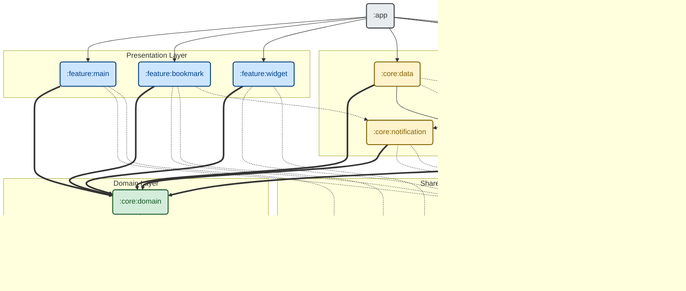

    
     
     
    

# 🔔 KNUTICE 

**국립한국교통대학교 공지사항 알리미 서비스**

> **Role:** 안드로이드 개발 (Android Native)
> 
> **Status:** 운영 중 (Play Store 배포)
> 
> **Users:** 총 사용자 300명+ / 월간 활성 사용자(MAU) 190명+

# 💁 Service Introduction

**"우리 학교 공지사항, 이제 놓치지 마세요."**

KNUTICE는 학교 홈페이지에 새 공지사항이 올라오면, 푸시 알림으로 가장 빠르게 알려주는 서비스예요.

학우들이 매번 학교 홈페이지에 접속해야 하는 번거로움을 없애고, 장학금이나 학사 일정 같은 중요한 정보를 놓치지 않도록 돕기 위해 만들었어요.

# ⚒️ Tech Stack

안정적인 서비스 운영과 확장성을 고려하여 최신 안드로이드 기술 스택을 적용했어요.

- **Language:** `Kotlin`
    
- **UI:** `Jetpack Compose` (Material3), `Jetpack Glance` (Widget), `Navigation for Compose`
    
- **Architecture:** `Multi-Module Clean Architecture`, `MVI (Unidirectional Data Flow)`
    
- **Async & Stream:** `Coroutines`, `Flow (StateFlow, SharedFlow)`
    
- **DI:** `Dagger 2`
    
- **Local DB:** `Room` (FTS4, Custom Tokenizer applied), `DataStore`
    
- **Background Task:** `WorkManager` (PeriodicWork, Chained Task)
    
- **Network:** `Retrofit2`, `OkHttp`
    
- **CI:** `GitHub Actions`
    

# ⚙️ Architecture

단순한 기능 구현을 넘어, 앱이 커져도 유지보수가 쉽도록 **Multi-Module Clean Architecture**를 도입했어요.

- **Multi-Module Strategy:** `app`, `core`, `feature`, `domain`, `data` 등 역할별로 모듈을 분리하여 코드 결합도를 낮추고 빌드 효율을 높였어요.
    
- **MVI Pattern:** `State`, `Event`, `SideEffect`를 명확히 분리하여 데이터 흐름을 단방향으로 관리함으로써, UI 상태 예측 가능성을 높이고 디버깅을 쉽게 만들었어요.

### Dependency Graph

# 🚀 Technical Challenges & Solutions

서비스를 개발하고 운영하면서 마주친 기술적 문제들과, 이를 해결한 과정을 정리했어요.

### 1. 로컬 검색 정확도 개선 (Room FTS4 + Tokenization)

사용자가 저장한 공지사항(북마크)을 검색할 때, 단순 SQL `LIKE` 쿼리는 정확도가 떨어지는 문제가 있었어요. 예를 들어 '공지'를 검색하면 의도와 다른 '인공지능'까지 검색 결과에 포함되곤 했어요.

- **Room FTS4(Full-Text Search)** 테이블을 도입하여 텍스트 검색 기능을 강화했어요.
    
- 한글 형태소 분석 라이브러리(`OpenKoreanTextProcessor`)를 활용해 검색어의 토큰을 분리하고, 이를 FTS 쿼리에 적용함으로써 **'인공지능' 등 불필요한 결과를 제외하고 정확히 '공지'와 관련된 항목만 필터링**하도록 개선했어요.
    

### 2. Custom Markdown Renderer 구현 (Parser & Native UI)

서버의 AI가 생성한 마크다운 응답을 기존 라이브러리로 렌더링할 경우, 앱의 디자인 테마와 이질감이 생기는 문제가 있었어요.

- **Native Component Mapping:** 단순한 텍스트 변환을 넘어, 마크다운의 구조적 요소(Heading, Table, Divider, List 등)를 각각의 **독립된 Native Composable**로 직접 구현하여 매핑했어요. 이를 통해 모든 UI 요소가 앱의 테마(Material Theme)와 100% 일치하도록 만들었어요.
    
- **Recursive Text Parsing:** 텍스트 내부의 `_**Bold & Italic**_`과 같은 복합 문법(Compound Syntax)은 **DFS 기반의 재귀 알고리즘**으로 파싱하여 `AnnotatedString`으로 변환함으로써, 중첩된 스타일도 깨짐 없이 정확하게 렌더링했어요.
    

### 3. UI 응답 속도 및 UX 개선 (Staging Table & WorkManager)

FTS 테이블은 인덱싱 과정 때문에 쓰기(Insert) 속도가 느린 편이에요. `Dispatchers.IO`로 작업을 분리했음에도, 북마크 저장 시 작업 시간이 길어져 `CircularProgressIndicator`(로딩 화면)가 너무 오래 지속되는 UX 문제가 있었어요.

- **Staging Table 전략:** 북마크 버튼을 누르면 즉시 인덱싱 비용이 없는 가벼운 `Staging Table`에 데이터를 저장하여, 로딩 상태를 바로 종료하고 쾌적한 UX를 제공했어요.
    
- **Deferred Indexing:** 이후 **WorkManager**가 백그라운드에서 Staging 된 데이터를 FTS 테이블로 안전하게 이관(Migration)하도록 파이프라인을 구축하여, 성능과 사용자 경험을 모두 잡았어요.
    

### 4. 안정적인 푸시 알림 수신 환경 (PeriodicWork)

앱이 오랫동안 실행되지 않거나 기기가 절전 모드에 들어가면 FCM 토큰이 만료되거나 동기화되지 않아 알림을 놓칠 위험이 있었어요.

- **WorkManager의 PeriodicWork**를 사용하여 주기적으로 FCM 토큰을 서버와 동기화하고 유효성을 검증하는 로직을 구현했어요. 이를 통해 사용자가 앱을 자주 켜지 않아도 중요한 공지 알림을 안정적으로 받을 수 있도록 했어요.

### 5. 메모리 누수 방지 및 네비게이션 최적화
Compose에서 바텀 네비게이션 탭을 자유롭게 이동하다 보면 ViewModel이 중복 생성되어 메모리를 불필요하게 많이 차지하는 문제가 있었어요.

- **Single-Top 라우팅 및 상태 복원**: Navigation for Compose를 중첩된 네비게이션 그래프(Nested Graph) 구조로 개편했어요. `launchSingleTop = true`와 `restoreState = true`를 적용해 ViewModel 인스턴스가 각 탭당 정확히 1개씩만 유지되도록 만들었어요.

- **상태 위임과 커스텀 백스택**: UI 레이어에서 라우팅 로직을 완전히 덜어내고, MainServiceState라는 전용 상태 홀더를 만들었어요. 내부적으로 커스텀 tabHistory 큐를 관리해서 UI 컴포넌트는 가볍게 유지하면서도 시간순으로 정확하게 뒤로 가기가 작동하도록 구현했어요.

- **프로파일링 성과**: Android Studio로 메모리를 꼼꼼히 프로파일링한 결과, 보존되는 ViewModel 메모리를 70% 줄이고 앱을 탐색할 때 발생하는 불필요한 JVM 객체 할당량을 23.6%(약 25만 개)나 줄일 수 있었어요.

### 6. Jetpack Glance RemoteViews 한계 극복 및 생명주기 동기화
열람실 좌석 현황을 더 빠르게 확인할 수 있도록 Jetpack Glance로 홈 화면 위젯을 만들었어요. 하지만 Glance는 OS 수준의 RemoteViews를 사용하기 때문에 커스텀 Canvas를 지원하지 않아, 동그란 링 형태의 그래프(Ring Graph)를 직접 그릴 수 없는 제약이 있었어요.

- **백그라운드 Bitmap 렌더링**: 이 한계를 넘기 위해 메인 스레드 밖에서 링 그래프를 정적인 이미지(Bitmap)로 먼저 그려낸 다음 위젯에 전달하는 방식을 선택했어요.

- **앱 생명주기 기반의 촘촘한 동기화**: 앱을 켰을 때와 위젯을 볼 때 데이터가 서로 달라지는 일이 없도록 새로고침 정책을 아주 세밀하게 설계했어요. 평소에는 Dagger 2로 주입한 `WidgetSyncWorker`가 백그라운드 업데이트를 담당하지만, 사용자가 앱을 켜거나 끌 때(ProcessLifecycle) 이를 감지해 로컬 캐시에 저장된 최신 데이터로 위젯을 즉시 업데이트하도록 만들어 완벽한 데이터 일관성을 유지했어요.

### 7. 파일 다운로드 안정성 및 MIME 타입 처리
1.7.0 이전 버전에서는 .hwp 같은 첨부파일을 다운로드할 때 파일명이 알 수 없는 문자로 깨지거나 다운로드 자체가 조용히 실패하는 문제가 있었어요. 서버가 내려주는 MIME 타입에만 무조건 의존하고, UTF-8로 인코딩된 파일명을 제대로 풀어내지 못한 것이 핵심 원인이었어요.

- **클라이언트 중심의 파일 처리**: 서버의 응답에만 기대는 대신, 앱 내부에서 직접 정확한 MIME 타입을 판별하고 UTF-8 파일명을 깔끔하게 디코딩하도록 다운로드 로직을 수정했어요. 덕분에 다운로드 매니저(DownloadManager)가 파일을 정상적으로 인식하고 처리할 수 있게 되었어요.

- **자연스러운 다운로드 경험 (UX)**: 앱 전용 폴더를 따로 만들어 파일을 숨기는 안티 패턴을 피했어요. 대신 사용자가 가장 찾기 쉽고 익숙한 기기 기본 '다운로드' 폴더로 파일이 바로 저장되도록 구현했어요.

### 8. Convention Plugin을 활용한 빌드 환경 최적화
멀티 모듈 구조로 프로젝트가 커지면서, 각 모듈마다 비슷한 빌드 설정과 라이브러리 버전 코드가 반복되는 문제가 있었어요.

- **빌드 로직 중앙화**: Kotlin DSL과 Gradle Convention Plugin(build-logic)을 도입해 파편화된 빌드 설정(SDK 버전, Compose 컴파일러 등)을 한 곳으로 모았어요.

- **유지보수성 향상**: 덕분에 불필요한 중복 코드를 없애고 전체 프로젝트의 버전을 완벽하게 동기화할 수 있었어요. 앞으로 새로운 모듈을 추가할 때도 훨씬 빠르고 안정적으로 확장할 수 있는 단단한 기반을 마련했어요.
    

# 🧐 What I Learned

이 프로젝트를 통해 안드로이드 프레임워크의 깊이 있는 활용법과 아키텍처의 중요성을 배웠어요.

- **Clean Architecture & Multi-Module:** 싱글 모듈에서 패키지로만 구분할 때와 달리, 실제 모듈을 분리하며 의존성 규칙을 강제하는 것이 유지보수와 빌드 속도에 어떤 이점을 주는지 체감했어요.
    
- **Compose & Lifecycle:** Jetpack Compose로 UI를 설계하며, 기존 명령형 UI(XML)와 다른 선언형 UI의 생명주기 관리법과 효율적인 재사용(Composable) 구조를 익혔어요.
    
- **Efficient Data Pipeline (Flow):** `StateFlow`로 UI 상태를 관리하고, `SharedFlow`와 `Channel`을 이용해 단발성 이벤트(Side Effect)를 처리해서 견고한 MVI 상태관리를 구현해 볼 수 있었어요. `snapshotFlow`를 활용해 사용자 입력을 실시간으로 감지하고, `debounce`와 `distinctUntilChanged` 연산자를 적용해 별도의 검색 버튼 없이도 과도한 네트워크 요청을 방지하는 최적화된 검색 로직을 설계했어요. 또한, `Remote/DB`에서 `Domain`을 거쳐 `ViewModel`로 이어지는 데이터 계층은 `Cold Flow`로 연결하여 끊김 없는 단방향 데이터 파이프라인(UDF)을 완성했어요.
    
- **Deep Dive into Dagger 2 (Migration from Hilt):** 초기에는 Dagger Hilt를 사용했으나, 멀티 모듈 전환 과정에서 프레임워크의 동작 원리를 더 깊이 이해하고자 Pure Dagger 2로 마이그레이션을 단행했어요. 이 과정은 쉽지 않았지만, `Component`와 `SubComponent`의 계층 구조, `Scope` 관리, `Builder/Factory` 패턴 등을 직접 구현해보며 Hilt의 편리함 뒤에 숨겨진 의존성 주입의 정석적인 매커니즘을 몸소 익힐 수 있었어요.
    
- **Modern Navigation:** Single Activity 구조에서 `Navigation for Compose`를 활용해 화면 간 전환과 데이터 전달(Argument passing)을 매끄럽게 처리하는 방법을 익혔어요.  

# 📱 Preview
| 홈 화면 | 학과 공지 모아보기 |
| :---: | :---: |
|  |  |

| AI 공지 요약 | 빠른 검색 | 북마크 & 메모 |
| :---: | :---: | :---: |
|  |  |  |

| 오늘의 학식 | 열람실 현황 |
| :---: | :---: |
|  |  |

| 공지 위젯 | 열람실 위젯 |
| :---: | :---: |
|  |  |

| 알림 필터 설정 |
| :---: |
|  |

 
